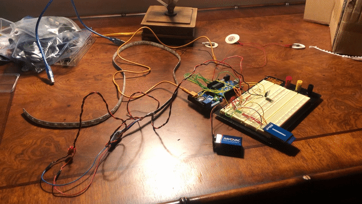

# Dream Phone

The dream phone is a device that enables communication between a lucid dreamer and the outside world.

This dream phone uses EOG (electrooculography) to allow the lucid dreamer to communicate. EOG, like EKG or EEG, reads electric signals from the body. Instead of reading heart beats like EKG, EOG reads eye movement.

_The dream phone when I'm wearing it while awake._

When a sleeping person is in a dreaming REM state, they are paralyzed except for the ability to control small twitches, the breath, and eye movements. They can signal with their eyes in morse code and EOG can detect these signals. The dream phone software can then translate the morse code into english letters.

_The dream phone in a pile on my desk_

## SD Card Version

Future versions will send messages to the internet. But this version saves massages to a file.

uses file: dream_phone_SD_card.ino

The Dream Phone SD

1. Detects rem
2. Induces lucidity (through light flashes)
3. Translates morse code messages
4. Saves messages to a text file on an SD card

## Hardware:

### Main:

1. [Heart and Brain SpikerShield Bundle](https://backyardbrains.com/products/heartandbrainspikershieldbundle)
2. Arduino Uno
3. Breadboard
4. 9 volt battery and [snap connector](https://www.amazon.com/Parts-Express-Battery-Clip-Pack/dp/B01IFP0N3U/)

### Light/Induction

1. 1 meter/60 led of [LED SMD strip](https://www.amazon.com/gp/product/B00DTOAWZ2/)
2. [Mosfet](https://www.amazon.com/gp/product/B071Z98SRG/)
3. 10k ohm resistor (brown-black-orange)

### SD Card Storage

4. [SD Card](https://www.amazon.com/Delkin-Devices-Select-UHS-I-Memory/dp/B078WVQXB1/)
5. [SD Card Module](https://www.amazon.com/gp/product/B07XGQ863W/)

## Set up:

### 1. Hook up the Arduino to the Heart and Brain Spikershield

For this version, we need to hook up the Heart and Brain SpikerShield with wires to the arduino uno, instead of stacking it ontop of the arduino.

Connect the following pins of arduino uno to the same spot on the HB shield if you were to stack it:

`D4`, `D6`, `D7`, `GND`, `5V`, and all the analog pins (`A0`, `A1`, etc) though, I'm not sure if all the `A`'s _have_ to be connected.

### 2. Hook up the SD Card Module to the arduino

- Card `CS` to Arduino `D5`
- Card `MOSI` to Arduino `D11`
- Card `SCK` to Arduino `D13`
- Card `MISO` to Arduino `D12`
- Card `3V` to Arduino `3V`
- Card `GND` to Arduino `GND`

### 3. Hook Up the Battery Snap To the arduino.

Connect the battery snap lines to the long long terminals on the breadboard and to then to the arduino:

- Battery Power to Arduino`VIN`
- Battery Ground to Arduino `GND`

### 4. Hook up the LED strip

1. Cut the led strip to 60 lights. I used an RGB led strip, non-addressable. But this project only uses the reds. On my strip a meter was 60 LEDs.

2. Following this image but only for the red LEDs, connect the red line of the LED strip to the arduino and the mosfet as seen here. Instead of connecting it to `D6` as pictures, connect it to `D9`. In our circuit, the 12V power is actual the 9V battery.

   

   1. Connect Arduino pin 9 to the gate leg of the MOSFET, and connect a 10k resistor in line to the ground rail.
   2. Connect the Source leg to the ground rail.
   3. Connect the Drain leg to the red connector on the LED strip.
   4. Connect the power rail (our 9V battery power) to the +12v connector of the LED strip (note that in this image the power wire is black to match the colors of the connectors on most LED strips).
   5. Connect the Arduino ground to the ground rail.

   6. Connect your 9v power supply to the power rails.

That's it for now, in the future I will add how to wear it, set it up, and test it out.
